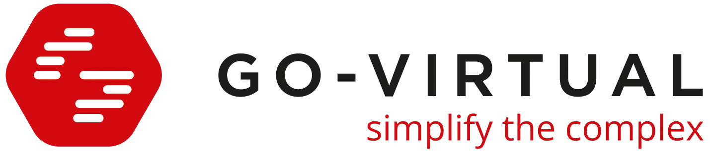

# 

**The smart engine powering planning, time & payroll.**

We build software that turns operational reality (projects, people, equipment, rules) into clean operational planning and correct payroll outputs.

## What we do

### SOLUTIO: Operational planning & execution

SOLUTIO helps organizations plan people, equipment and projects with real-time visibility and fast re-planning when reality changes (skills, shifts, absences, last-minute work). Mobile registration connects the field to back-office workflows.

### VIRO: Time, payroll rules & exports

VIRO automates complex time & compensation calculations (collective agreements + company rules) and produces clean, export-ready outputs for payroll providers / HR administration—reducing errors, discussion and month-end stress.

## Why this GitHub exists

Most of our product code lives in private repositories. This GitHub organization is where we:

- maintain or fork core components we rely on (especially geospatial & geofencing building blocks),
- publish reusable utilities and templates when we can,
- keep community health files and shared CI patterns for our repos.

## Featured repositories

- **orb** (fork) — Types and utilities for 2D geometry in Go (GeoJSON, planar geometry, etc.).
- **tile38** (fork) — Real-time geospatial data store & geofencing server in Go.
- **.github** — Organization profile + default community files.

> Note: forks may include internal patches, version pinning, or CI adaptations.
> When possible, we contribute improvements upstream.

## Contact

- Website: <https://www.go-virtual.com>
- Sales: <sales@go-virtual.com>
- Support: <support@go-virtual.com>
- Blog: <https://www.go-virtual.com/blog>

## Jobs

We like people who enjoy messy real-world puzzles.

See open roles: <https://www.go-virtual.com/jobs>

---

*This repository is maintained by the Go Virtual team.*
