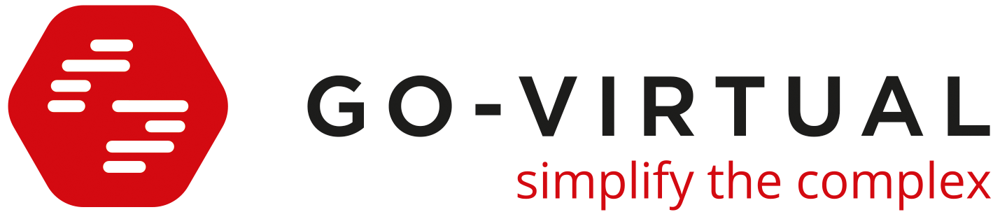

# 

**The smart engine powering planning, time, payroll & worksite safety.**

We build software that turns operational reality (projects, people, equipment, rules) into clean operational planning, correct payroll outputs and real-time protection for workers in the field.

## What we do

### SOLUTIO: Operational planning & execution

[SOLUTIO](https://www.go-virtual.com/en/planning-software-solutio) helps organizations plan people, equipment and projects with real-time visibility and fast re-planning when reality changes (skills, certificates, shifts, absences, last-minute work). Mobile registration connects the field—hours, mobility, materials, photos, checklists—to back-office workflows.

### VIRO: Time, payroll rules & exports

[VIRO](https://www.go-virtual.com/en/pre-payroll-software-viro) automates complex time & compensation calculations (collective agreements + company rules) and produces clean, export-ready outputs for payroll providers / HR administration—reducing errors, discussion and month-end stress.

### VireXGuard: Real-time wearable safety

[VireXGuard](https://www.virexguard.com) is a wearable safety platform for high-risk worksites—ports & terminals, rail infrastructure, petrochemical & energy, heavy construction. It combines centimeter-accurate RTK GNSS positioning with dynamic geofencing: safety zones are drawn and updated live from a dashboard, and workers get instant vibration, LED and audio alerts *before* proximity becomes an incident.

## Featured repositories

- **[tile38.go](https://github.com/GO-VIRTUAL-bv/tile38.go)** — A dependency-free Go client for the Tile38 geospatial database: RESP over `net.Conn`, with searches, hooks, channels, and live geofence streaming. Built and maintained by us.

## Contact

- Website: <https://www.go-virtual.com>
- VireXGuard: <https://www.virexguard.com> · <info@virexguard.com>
- Sales: <sales@go-virtual.com>
- Support: <support@go-virtual.com>
- Blog: <https://www.go-virtual.com/en/blog>

## Jobs

We like people who enjoy messy real-world puzzles—from collective-agreement payroll rules to centimeter-accurate geofencing.

See open roles: <https://www.go-virtual.com/jobs>

---

*This repository is maintained by the Go Virtual team.*
